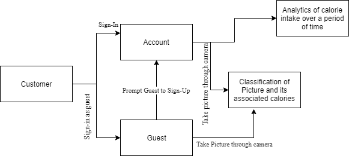

# Project Requirements

## Functional Requirements 
* Allows users to take a picture of what they are eating and return an approximate number of calories
* Show users detailed analytics of their consumption habits over time through data visualization
* Allow users to set daily calorie thresholds
* Alert users if they have exceeded/haven't met those calorie thresholds
* Allow users to view calorie intake by nutritional component i.e carbohydrates, fats, proteins, vitamins, etc 
* Allow users to log in via an existing account such as Google or Facebook 
* Motivate users to keep counting calories through some sort of means of encouragement. 

## Non Functional Requirements 
* Project will be implemented as a Progressive Web App to allow for cross-platform compatability and efficiency on the user end.
* Project Tech Stack - Primarily MERN. 
  * MongoDB - For database-related processes
  * Express.js - for setting up backend server 
  * React.js - For front end development
  * Node.js - Backend API handling
  * Tensorflow.js - For the machine learning component
  * Tensorflow - initial prototype before converting to Tensorflow.js 
  * D3.js/other data visualisation library - for creating the analytics components. 

## Stakeholder Interviews 

### Questions Asked 

* Are you conscious of how many calories you consume whenever you eat?
  * *(Answer 1) Is conscious of how sugary or oily the food is above anything is. Also cares about whether he gets enough protein, good carbs and veggies.* 
* Have you ever tried counting calories while eating?
  * *(Answer 1) Hasn’t quantified the amount of calories per se, but pays attention to portion size or the food itself , for example, he knows that a slice of pizza is going to be greasy and oily so he has a qualitative estimation of calories above anything else.*
* What apps(if any) have you used for counting calories?
  * *(Answer 1) Has tried MyFitnessPal. Found it to be too cumbersome.*
* Was the process of counting calories straightforward or tedious?
   * *(Answer 1) Found it to be too cumbersome*
* If you ever did count calories, did you ever use that information to adjust your diet?
   * *(Answer 1) Would love to know where his diet lacks and where he can improve.*
* Were you consistent with counting calories?
   * *(Answer 1) No*
* How would make the process of counting calories less of a chore and more efficient?
   * *(Answer 1) Taking a picture of your food and then getting an eyeball estimate of how many calories are present would be pretty cool*
* How do you feel about your consumption habits being recorded and used to provide customized analytics?
   * *(Answer 1) Would definitely appreciate this feature as he could find out which food he might need to eat less of, etc*
* What is your expectation of user experience in terms of front-end?
  * *(Answer 1) Needs to be sleek, and intuitive to use*

## End-User Personas
Our end-user will generally be a normal person with a fitness goal or interest. For example, lets say we have a normal office worker named Steve. Steve wants to make a return to the dating scene and as a result, wants to lose some fat. He starts going out to the gym a few times a week, and starts to limit his calories per day. Unfortunately, his eating habits vary day by day, and he has no time to cook. He usually gets take out, or eats whatever lunch is provided by the company, and so he doesn't usually know the calories counts of his meals. Thus, he starts using Calorie Counter, which provides him approximate nutrition information for his meals with a simple picture of each meal and allows him to monitor his eating habits long-term. Eventually, through perserverence, he makes a successful redebut on the dating scene.

Steve's background could have been completely different, but the main point is a desire to monitor eating habits for fitness/health reasons. Steve could be a college student, or even a stay-at home dad, but as long as he wanted to get nutrition information on his meals in a simple and intuitive way, he would find a use for Calorie Counter. Alternatives today exist in fitness apps such as MyFitnessPal but adding meal content part by part is slow and tedious. Calorie Counter needs to and will be a fast and simple way to check our calorie intake daily with a simple picture per meal.

## Use Cases

\
Title: Sign-up\
Actor: Customer

Scenario: A new customer will be able to sign up for an account in the application so that the customer's associated food habits and its associated data could be stored.

Title: Sign-in\
Actor: Customer

Scenario: A returning customer will be able to sign in to their existing account in the application so that the they can see their food habits and its trend so that they can take some action if they want.

Title: Check calorie count of food item\
Actor: Customer

Scenario: The customer wants to know the calorie count of an item. He opens the "calorie-counter" application, takes a photo of the food and the application automatically classifies the item along with the calorie count of a standard serving It would also ask the customer if he.she would like to add the food the meal after viewing the calorie count. In this way it can keep count of the calorie intake during a certain part of the day.

Title: Check calorie-intake breakdown(analytics) by food type(proteins, carbohydrates, fats, etc)\
Actor: Customer

Scenario: The customer should be able to take corrective measures regarding his eating habits to ensure implementation wight-loss or other body-strengthning activities. It would allow the customer if he/she is consuming too much fat for lunch or if they are not having adequate protein in his diet.  

## Domain Model

